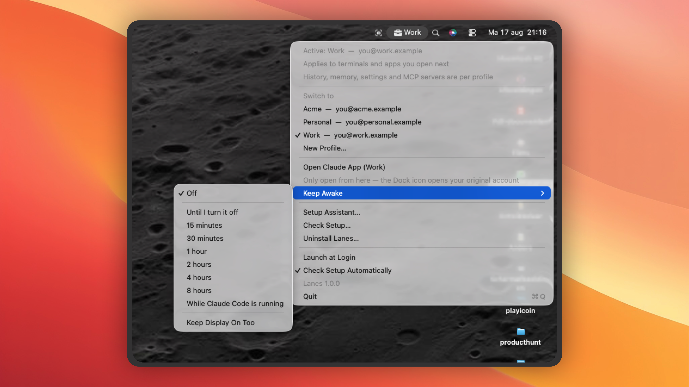

# Lanes



Account lanes for Claude Code. Switch accounts from the macOS menu bar, and see at
a glance which one you are in.

*Not affiliated with, endorsed by, or sponsored by Anthropic. Claude is a trademark
of Anthropic, PBC.*

Claude Code can only be logged into one account at a time. Lanes switches between
them and keeps the active name permanently visible, because running the wrong
account against a client's codebase is a bad afternoon.

## Install

macOS 13 or newer, and Xcode Command Line Tools (`xcode-select --install`).

```bash
git clone https://github.com/rowansail/lanes
cd lanes
./build.sh
```

Compiles, signs ad-hoc, installs into `/Applications` and launches. The app checks
your setup shortly after and opens a wizard if anything needs doing — it can convert
an existing Claude Code install into your first profile.

Then, once per profile:

```bash
exec zsh                # activate the hook in this terminal
claude auth login
```

There are no binary releases. The ad-hoc signature is enough for a Mac to trust an
app you compiled yourself and not enough to hand someone a `.app` — and for a tool
that edits your shell config, building it yourself means the code you audited is the
code you ran.

## How it works

1. An account **is** a folder path. Claude finds its credentials in the Keychain
   under a hash of that path.
2. `CLAUDE_CONFIG_DIR` decides which folder is used.
3. A process gets its environment at startup and it cannot be changed from outside
   afterwards. So Lanes writes the active profile to a small file, and a shell hook
   reads it in every new shell.

The consequence that catches everyone once: **an already-running terminal or Claude
session does not follow along.** Switching applies to what you start next.

Every folder named `~/.claude-*` is a profile. No registry, no config file — a new
folder appears in the menu within five seconds.

## Where it works

| | What Lanes does | What to know |
|---|---|---|
| **Terminal** | sets `CLAUDE_CONFIG_DIR` in every new shell, honours project pins | open a new shell after switching |
| **VS Code** (and Cursor, VSCodium, Windsurf) | the extension inherits it when the editor launches | quit the editor completely to change lanes — reloading the window is not enough |
| **Claude desktop app** | gives each profile its own Electron data directory | open it from the Lanes menu; the Dock icon opens your original account |

> **The Dock icon is not a lane.** A profile is passed as a launch argument, and a
> Dock icon has no launch arguments. Use `Open Claude App (Work)` in the menu, or
> `lane app`. Your original Claude stays exactly as it was.

In VS Code, `"claudeCode.useTerminal": true` runs Claude in the integrated terminal,
which is a real shell — so the hook and project pins both apply, and new terminals
pick up the current lane without relaunching anything.

## From the terminal

`lane` is a shell function defined by the same hook the wizard installs — nothing
extra to install, and nothing on `$PATH`.

```bash
lane                        # active profile, the pin, and all profiles
lane work                   # switch
lane app [name]             # desktop app in a profile
lane lock [name]            # pin this directory to a profile
lane unlock                 # remove the pin
```

## Project pins

A `.lanes` file holding a profile name pins that directory and everything under it.
`claude` then runs against that profile whatever is globally active, because an
explicit per-project statement should outrank a menu click from last Tuesday.

```bash
cd ~/projects/acme && lane lock acme
```

Commit it to share the pin, or add it to `.git/info/exclude` to keep it yours.
`LANES_NO_LOCK=1` bypasses it. Pins do not apply in VS Code's native panel — see the
`useTerminal` note above.

## Keep Awake

Menu → `Keep Awake` stops your Mac sleeping through a long run: a fixed duration,
until you turn it off, or **while Claude Code is running** — which follows the
`claude` process and lets go when it exits. A ☕ and a countdown appear in the menu
bar while it is on.

It is an IOKit power assertion, the same thing `caffeinate` uses, and it deliberately
does not survive a restart.

## When something is wrong

```bash
./doctor.sh
```

A read-only report that changes nothing. It runs in *your* shell, so it sees the real
`CLAUDE_CONFIG_DIR` — which the app cannot, having been launched by macOS.
`Check Setup…` in the menu runs the same checks from inside the app.

- **Nothing changed after switching** — that terminal keeps its old environment.
  `exec zsh`, or a new tab.
- **VS Code is on the wrong account** — quit the editor entirely; `Developer: Reload
  Window` restarts the extension host but not its parent.
- **`$CLAUDE_CONFIG_DIR` is empty** — the hook is not installed. The app offers to fix it.
- **You keep landing in the same profile** — something sets the variable *after* the
  hook: an `export` in `.zshrc`, or `terminal.integrated.env.osx` in VS Code.

## Uninstalling

`Uninstall Lanes…` in the menu, with two genuinely different answers: keep your
Claude Code and remove Lanes (a profile moves back to `~/.claude` intact), or remove
everything (profile folders go to the **Trash**, listed by name, with a final
confirmation). Project pins are never touched.

## A standing caveat

`CLAUDE_CONFIG_DIR` and the Keychain naming it implies are **undocumented** — derived
from observing Claude Code, not from a specification, and Anthropic can change them in
any release. If isolation stops working after an update, suspect that first.
`Check Setup…` reports the detected Claude Code version for exactly this reason.

## Licence

[GPL-3.0-or-later](LICENSE). Modified versions stay open under the same licence.
[SECURITY.md](SECURITY.md) covers why the app never reads a credential;
[CONTRIBUTING.md](CONTRIBUTING.md) covers building and testing.

Lanes is not affiliated with, endorsed by, or sponsored by Anthropic. "Claude" appears
only as a descriptor of what the tool works with, and none of Anthropic's logos or
brand styling are used anywhere.
