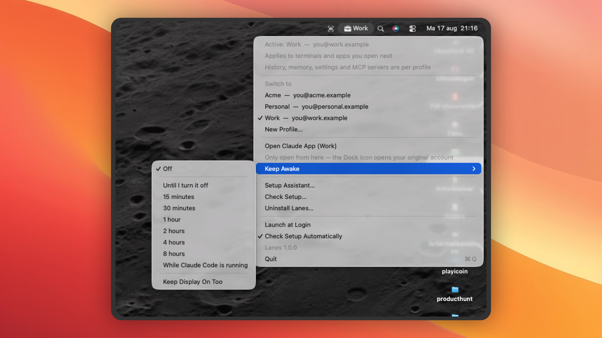

# Lanes

**One Claude Code account per lane. Switch from the macOS menu bar, always see which one you're in, and never hand your credentials to a third-party app.**

[](LICENSE)


<!--
  The twenty-second loop goes here, the moment docs/demo/record.sh has been used
  to record one: the menu bar says Work, you cd into a pinned repo, run claude,
  and it comes up on acme anyway. Uncomment the line below when the file exists —
  docs/demo/README.md has the framing, the beats and the ffmpeg invocation.
  
-->

https://github.com/user-attachments/assets/65b5cedc-76e6-4901-9194-02478c74735b

Claude Code can only be logged into one account at a time. Lanes gives each account its own config folder, keeps the active one permanently visible in the menu bar, and lets a repo pin itself to the account it belongs to.

Because running the wrong account against a client's codebase is a bad afternoon.

```bash
brew install rowansail/tap/lanes
lanes
```

---

## Why this one

- **It never reads your token.** Every other switcher copies credentials, rewrites a provider config, or swaps a Keychain item. Lanes points `CLAUDE_CONFIG_DIR` at a different folder and lets Claude Code look up its own secret. There is nothing to leak, back up, or trust.
- **The active account is on screen at all times.** Not in a submenu. In the menu bar, next to the clock.
- **Pins live in the repo, not on your laptop.** Drop a `.lanes` file naming a profile and that directory is pinned. Commit it and everyone who clones the repo is in the right account on their first run.
- **Keep Awake for long runs.** A fixed duration, until you turn it off, or exactly as long as `claude` is running.
- **No registry, no config file.** Any folder named `~/.claude-*` is a profile. Create one and it appears in the menu within five seconds.

*Not affiliated with, endorsed by, or sponsored by Anthropic. Claude is a trademark of Anthropic, PBC.*

---

## Install

macOS 13 or newer.

```bash
brew install rowansail/tap/lanes
lanes
```

`brew install` compiles from the tagged source on your machine. `lanes` then links the app into `/Applications` — the only place macOS offers Launch at Login from — and opens it.

Or clone it, which is the same build:

```bash
git clone https://github.com/rowansail/lanes
cd lanes
./build.sh                # compiles, signs ad-hoc, installs, launches
```

Either way the app checks your setup shortly after launching and opens a wizard if anything needs doing — it can convert an existing Claude Code install into your first profile. Then, once per profile:

```bash
exec zsh                # activate the hook in this terminal
claude auth login
```

<details>
<summary><b>Why two commands, and why no binary release?</b></summary>

<br>

Homebrew sandboxes a formula so it cannot write outside its own prefix — that sandbox is the point of it — so the app cannot put itself in `/Applications` during install. A cask could, and a cask installs a binary someone else compiled. `lanes` is the smallest thing that closes the gap without giving that up.

The ad-hoc signature is enough for a Mac to trust an app you compiled yourself and not enough to hand someone a `.app`. For a tool that edits your shell config, building it yourself means the code you audited is the code you ran. Homebrew removes the four commands, not that guarantee.

Xcode Command Line Tools (`xcode-select --install`) supply the compiler. The project has no dependencies, so nothing else is fetched.

</details>

---

## How it works

1. An account **is** a folder path. Claude finds its credentials in the Keychain under a hash of that path.
2. `CLAUDE_CONFIG_DIR` decides which folder is used.
3. A process gets its environment at startup and it cannot be changed from outside afterwards. So Lanes writes the active profile to a small file, and a shell hook reads it in every new shell.

> [!IMPORTANT]
> The consequence that catches everyone once: **an already-running terminal or Claude session does not follow along.** Switching applies to what you start next.

---

## Project pins

A `.lanes` file holding a profile name pins that directory and everything under it. `claude` then runs against that profile **whatever is globally active**, because an explicit per-project statement should outrank a menu click from last Tuesday.

```bash
cd ~/projects/acme && lane lock acme
```

```
~/projects/acme $ claude
lanes: ~/projects/acme is pinned to 'acme' — using it for this command.
```

It is a file in the repository, not an entry in a registry on your laptop. Commit it and the whole team inherits it; add it to `.git/info/exclude` to keep it yours. `LANES_NO_LOCK=1` bypasses it.

Pins do not apply in VS Code's native panel — see [Where it works](#where-it-works).

---

## Keep Awake



Menu → `Keep Awake` stops your Mac sleeping through a long run: a fixed duration, until you turn it off, or **while Claude Code is running** — which follows the `claude` process and lets go when it exits. A ☕ and a countdown appear in the menu bar while it is on.

It is an IOKit power assertion, the same thing `caffeinate` uses, and it deliberately does not survive a restart.

---

## From the terminal

```bash
lane                        # active profile, the pin, and all profiles
lane work                   # switch
lane app [name]             # desktop app in a profile
lane lock [name]            # pin this directory to a profile
lane unlock                 # remove the pin
```

`lane` is a shell function defined by the same hook the wizard installs — nothing extra to install, nothing on `$PATH`.

(The one exception: a Homebrew install also puts `lanes`, plural, on `$PATH`. That is the launcher from the install step, and it has nothing to do with switching accounts. `lane` is the one you want.)

---

## Where it works

| | What Lanes does | What to know |
|---|---|---|
| **Terminal** | sets `CLAUDE_CONFIG_DIR` in every new shell, honours project pins | open a new shell after switching |
| **VS Code** (and Cursor, VSCodium, Windsurf) | the extension inherits it when the editor launches | quit the editor completely to change lanes — reloading the window is not enough |
| **Claude desktop app** | gives each profile its own Electron data directory | open it from the Lanes menu; the Dock icon opens your original account |

> **The Dock icon is not a lane.** A profile is passed as a launch argument, and a Dock icon has no launch arguments. Use `Open Claude App (Work)` in the menu, or `lane app`. Your original Claude stays exactly as it was.

In VS Code, `"claudeCode.useTerminal": true` runs Claude in the integrated terminal, which is a real shell — so the hook and project pins both apply, and new terminals pick up the current lane without relaunching anything.

---

## How it compares

The other tools in this space mostly swap credentials between accounts. Lanes never touches one.

| | **Lanes** | [cc-switch](https://github.com/farion1231/cc-switch) | [CCSwitcher](https://github.com/XueshiQiao/CCSwitcher) | [claude-swap](https://github.com/realiti4/claude-swap) |
|---|---|---|---|---|
| **How it switches** | points `CLAUDE_CONFIG_DIR` at a separate config folder | rewrites the provider config | swaps the Keychain item and `~/.claude.json` | swaps the stored login in the OS credential store |
| **Reads your token** | **never** | holds the API keys it manages | yes, and keeps its own encrypted backups | yes, reads and stores OAuth tokens |
| **Per-project pin** | **a `.lanes` file you can commit** | – | – | yes, a directory→account map on your machine |
| **Active account always on screen** | yes, in the menu bar | tray menu | yes, in the menu bar | optional menu bar app |
| **Keep awake for long runs** | yes | – | – | – |
| **Usage / rate-limit dashboard** | – | – | yes | yes, and auto-rotates at the limit |
| **Third-party providers and relays** | – | yes, 50+ presets across 8 tools | – | – |
| **Platform** | macOS 13+ | macOS, Windows, Linux | macOS 14+ | macOS, Linux, Windows |
| **Ships as** | source you compile | signed binaries | signed DMG, auto-updates | Python package |
| **Licence** | GPL-3.0-or-later | MIT | not stated | MIT |

Read that as a shape, not a scoreboard. **Use something else** if you want one tool across Windows and Linux (`cc-switch`, `claude-swap`), if you are switching between API relays rather than between Anthropic accounts (`cc-switch`), if you want a live quota dashboard or automatic rotation when an account hits its limit (`claude-swap`, `CCSwitcher`), or if you would rather install a signed binary than compile one.

What is only here: the pin is a file in the repo, so it travels with the project rather than living in one developer's config; and switching accounts never requires reading a secret, because pointing at a different folder makes Claude Code look up a different Keychain item on its own. [SECURITY.md](SECURITY.md) has the detail, and the reason that rule is not negotiable.

---

## Skip Bypass Permissions Warning

Claude Code records that you have read the Bypass Permissions warning *per config directory*. Lanes gives you several of those, so the dialog comes back once per lane, and again for every lane you make afterwards.

Menu → `Skip Bypass Permissions Warning` writes `"skipDangerousModePermissionPrompt": true` into every lane's `settings.json` — the same key, in the same file, that clicking Accept writes. New lanes inherit it. Switching it off removes the key again.

Everything else in that file is left alone, and a `settings.json` that is not plain JSON — comments, a trailing comma — is reported and not written rather than reformatted. It is the only thing Lanes ever writes inside a profile.

This covers that one dialog and nothing else. It does not touch per-tool permission prompts, and it is unrelated to the Claude-in-Chrome prompts asking to run JavaScript on a site, which the extension grants per domain on its own.

---

## When something is wrong

```bash
./doctor.sh
```

A read-only report that changes nothing. It runs in *your* shell, so it sees the real `CLAUDE_CONFIG_DIR` — which the app cannot, having been launched by macOS. `Check Setup…` in the menu runs the same checks from inside the app.

| Symptom | Cause |
|---|---|
| Nothing changed after switching | That terminal keeps its old environment. `exec zsh`, or open a new tab. |
| VS Code is on the wrong account | Quit the editor entirely. `Developer: Reload Window` restarts the extension host but not its parent. |
| `$CLAUDE_CONFIG_DIR` is empty | The hook is not installed. The app offers to fix it. |
| You keep landing in the same profile | Something sets the variable *after* the hook — an `export` in `.zshrc`, or `terminal.integrated.env.osx` in VS Code. |

---

## Uninstalling

`Uninstall Lanes…` in the menu, with two genuinely different answers: keep your Claude Code and remove Lanes (a profile moves back to `~/.claude` intact), or remove everything (profile folders go to the **Trash**, listed by name, with a final confirmation). Project pins are never touched.

Then remove the app itself:

```bash
brew uninstall lanes
rm /Applications/Lanes.app     # that symlink was made by `lanes`, not Homebrew
```

If you built it yourself, drag it to the Trash.

---

## A standing caveat

`CLAUDE_CONFIG_DIR` and the Keychain naming it implies are **undocumented** — derived from observing Claude Code, not from a specification, and Anthropic can change them in any release. If isolation stops working after an update, suspect that first. `Check Setup…` reports the detected Claude Code version for exactly this reason.

---

## Licence

[GPL-3.0-or-later](LICENSE). Modified versions stay open under the same licence.

- [SECURITY.md](SECURITY.md) — why the app never reads a credential
- [CONTRIBUTING.md](CONTRIBUTING.md) — building and testing
- [CHANGELOG.md](CHANGELOG.md) — what changed and when

Lanes is not affiliated with, endorsed by, or sponsored by Anthropic. "Claude" appears only as a descriptor of what the tool works with, and none of Anthropic's logos or brand styling are used anywhere.
